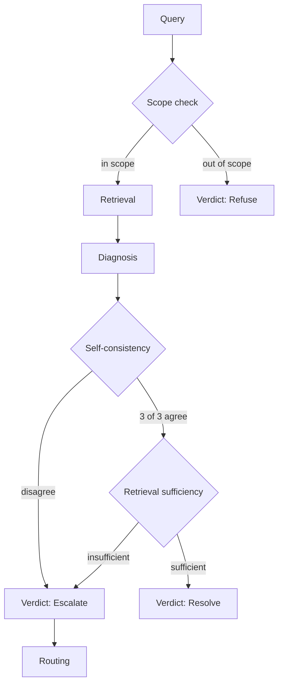

# admin-diagnosis-agent

**An AI agent for workspace access diagnosis. Three outcomes — resolve, escalate, refuse — gated by self-consistency and retrieval sufficiency. Built around one decision: confidently wrong is worse than refusing.**

→ Live demo: https://admin-diagnosis-agent.vercel.app

Most AI helpdesk products — Risotto, Druid, Moveworks, ServiceNow's AI tier — market autonomous execution. This project takes the opposite position: the agent commits to a diagnosis only when self-consistency and retrieval sufficiency both pass. Otherwise it escalates to a human, or refuses the question outright. Evals were built first — 40/40 grader agreement, 0% false-escalation, 15/15 trust-safety on scope mutations — and the eval results drove the design.

## How it works

Three gates in sequence. **Scope check** runs first — out-of-scope queries (off-topic, execution requests) are refused immediately, skipping the rest of the pipeline.

For in-scope queries, the agent retrieves the relevant runbook and produces a diagnosis three times independently. **Self-consistency** requires all three to agree; disagreement routes to a human reviewer. If self-consistency passes, **retrieval sufficiency** checks whether the retrieved runbook actually contains the information needed to back the diagnosis. If it doesn't, the diagnosis is also routed to a human.

Resolve happens only when both gates pass. Escalations carry the diagnosis and gathered context forward — the reviewer doesn't restart from zero.

## Evals built first

The eval harness was built before the agent. A single hand-crafted golden scenario seeded the test set; from there, mutations across three axes — spine (same shape, different entities), anomaly (boundary cases like the scope perimeter), and robustness (paraphrases and near-duplicates) — expanded coverage. Each scenario had to pass a three-criteria filter to earn a slot: distinct failure mode, gradable without a labeler, and aligned with the trust thesis.

The numbers below are from this test set, not synthetic self-evaluation:

| Metric | Result |
|---|---|
| Grader agreement on diagnoses | 40 / 40 |
| False escalations across paraphrases | 0% |
| Trust-safety on scope mutations | 15 / 15 |

Grader agreement measures whether the agent's diagnosis matches the hand-labeled correct answer on each spine scenario. False escalation measures whether trivial query rewordings cause an in-scope query to be incorrectly routed to a human. Trust-safety measures whether scope-boundary mutations — queries designed to sit just outside the agent's scope — get refused correctly rather than confidently misdiagnosed.

Each metric maps to a specific failure mode the agent is built to avoid. The eval results drove design decisions on routing thresholds, refusal scope language, and the two-gate confidence mechanism.

→ [Design log](docs/design-decisions/) for the full methodology + decision history.

## What's live vs planned

The demo is a portfolio artifact, not a product. The status table below is honest about what's actually implemented versus what's been designed but deferred.

| Capability | Status |
|---|---|
| Three-verdict diagnosis (resolve / escalate / refuse) | Live |
| Self-consistency + retrieval-sufficiency gates | Live |
| Scope-perimeter refusal | Live |
| Reasoning trace (admin view) with sequential reveal | Live |
| End-user view with persona-driven disclosure | Live |
| Routing to canonical owner (identity / resource / support) | Live |
| Seed-and-mutate eval harness | Live |
| Five seeded scenarios across the verdict space | Live |
| User-supplied diagnosis context (BYO data) | Planned |
| Refuse-reason taxonomy for eval categorization | Planned |
| Expanded scenario coverage (false-healthy, post-change drift) | Planned |
| Real OAuth into identity providers | Out of scope |

## What this is NOT

This is a portfolio project. It's an honest example of how I'd build trust-conservative AI products — not a tool you'd deploy.

The scope was bounded deliberately:

- **No real integrations.** The runbook, identity graph, and permission state are synthetic. The agent reasons against curated data, not a live Google Workspace or Okta tenant.
- **No persistence.** Every session is ephemeral. No accounts, no storage, no multi-tenant.
- **No expansion of the runbook beyond what the eval test set requires.** Adding scenarios means adding evals first; the eval harness is the gating mechanism, not the runbook.
- **No procedural automation.** The agent diagnoses and recommends; a human admin acts on the diagnosis. The "act on it" surface — automated grant adjustments, ticket creation, status callbacks — is deliberately out of scope.

Each of these is a design choice with a reason behind it. Trust-conservative AI isn't just a model behavior; it's a scope discipline. Demoing capability the system can't back with evidence breaks the same contract the agent itself maintains.

## Stack + context

Built with Next.js, TypeScript, and Voyage embeddings. LLM calls go through Anthropic's API. Deployed on Vercel.

Design provenance lives in two places:

- [`docs/specs/`](docs/specs/) — what was built, per chunk
- [`docs/design-decisions/`](docs/design-decisions/) — why, including alternatives considered and killed

The project was built as the capstone for an AI PM course. The course informed the methodology; the design choices, architecture, and scope are mine.
