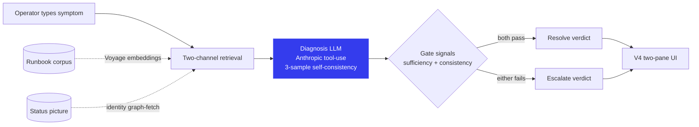

# Admin Diagnosis Agent

A confidence-gated agentic system that diagnoses enterprise admin issues — and knows when not to act.

## The thesis

Most AI products fail in the same place: they confidently produce a wrong answer when they should have escalated. The gap isn't retrieval, and it isn't generation — it's the triage decision in the middle. Can I act on this, or should I hand it to a human with enough context that they can fix it?

This system is that triage layer for an enterprise admin's job: an operator describes a symptom ("user can't access folder X"), and the system either resolves with a verified fix or escalates with the diagnosis-so-far + the ambiguous signal + routing rationale — never a confidently wrong answer that looks plausible.

The architecture is built around confidence signals; if any is weak, the system escalates rather than acts. The whole stack — retrieval, the diagnosis call, the gate, the eval harness — is designed to refuse silent failure at every layer.

## Architecture



The diagram evolves with each chunk:

* Chunk 3 will add a `refuse_out_of_scope` verdict for queries outside the system's scope.
* Chunk 5 will add a third gate signal (`recent_change_addressed`) plus change-log retrieval.
* Chunk 6 will add contested-routing handling for escalations with multiple plausible owners.

The current diagram reflects what's actually built. When the architecture grows, the diagram grows in the same commit.

## What's built so far

**Phase 1 — Scope & Research.** Problem statement, JTBD decomposition, competitor map (Glean Admin Chat, Glean Notifications, Moveworks, Datadog Watchdog), metric architecture grounded in escalate-recall ≥95%. Five golden-set scenarios sourced from real operator incidents.

**Phase 2 — Design.** Confidence gate with three signals (evidence sufficiency, answer consistency, recent-change-accounted-for). Data model splitting "observed world" from "process record." V4 two-pane UI flow (reasoning visible before the verdict). Scenario schema with pinned-signal grading.

**Phase 3 — Build, in progress.**

* ✅ Chunk 1 — Eval harness ("the ruler"). Hand-crafted Seed 1, validated in both directions before any system code existed. The ruler catches confidently-wrong outputs structurally, with an audit trail showing why each judgment was made.
* ✅ Chunk 2 — System backend + V4 UI, Seed 1 end-to-end. Two-channel retrieval (Voyage embeddings + identity graph-fetch), Anthropic tool-use with two-tool design, two-signal confidence gate, V4 two-pane UI styled to Glean's design system. Real Seed-1 output validated by the chunk-1 grader for the right reasons.
* ⬜ Chunk 3 — Out-of-scope refusal handling (Seed 5).
* ⬜ Chunks 4–6 — Seeds 2, 3, 4.
* ⬜ Chunk 7 — Deployment + polish.

## Design provenance

Every design decision in this project has a real-time log entry capturing the options considered, the call made, the reasoning, and what would change the decision. The discipline: facts owned by code, judgment owned by author.

* `DESIGN-DECISIONS.md` — Chunk 1's eight build-time design decisions
* `CHUNK2-DESIGN-DECISIONS.md` — Chunk 2's seventeen decisions (Q1–Q6 grill-me + Q7–Q17 build-phase)
* `UI-DESIGN-DECISIONS.md` — UI grill-me decisions (aesthetic system, IA, outcome-component architecture)
* `VALIDATION-NOTES.md` — Chunk 1's validation artifact: what was tested, what the ruler reported, why each result is correct, what would invalidate it going forward (with §4 caveats appended during chunk 2)

## Stack

* Next.js (app router), TypeScript strict
* Anthropic SDK with tool-use for schema-enforced output (`claude-sonnet-4-6`)
* Voyage AI embeddings (`voyage-4-lite`) for runbook retrieval
* TanStack Query for server state, `useState` for local UI state
* Tailwind v3 wired to a `tokens.ts` extracted from glean.com

## Running locally

Two npm packages live side by side in this repo: the Next.js app (the repo root) and the chunk-1 eval harness (`eval/`). Each has its own env file and dependencies.

The Next.js app (from the repo root):

```bash
echo "ANTHROPIC_API_KEY=sk-ant-..." > .env.local
echo "VOYAGE_API_KEY=pa-..." >> .env.local
npm install
npm run dev
```

The app boots at `localhost:3000` (or whatever port Next picks; check the console).

The chunk-1 eval harness (from the repo root):

```bash
cd eval
cp .env.example .env
# add ANTHROPIC_API_KEY to .env
npm install
npm run validate                       # runs chunk-1's original validation
npx tsx src/grade-system-output.ts     # grades chunk-2's exported system output
```

## Reading order, if you're a hiring manager or reviewer

If you have 10 minutes:

1. This README (you're here)
2. `VALIDATION-NOTES.md` — what the ruler actually proves, plus the chunk-2 §4 caveats (calibration limits, armed-but-unexercised paths)
3. `CHUNK2-DESIGN-DECISIONS.md` — the seventeen decisions that shaped the system

If you have 30 minutes, add:

4. `CHUNK1-SPEC.md` — chunk 1's spec (what was being built before chunk 2 started)
5. `DESIGN-DECISIONS.md` — chunk 1's full decision log
6. `UI-DESIGN-DECISIONS.md` — UI grill-me

The design logs are where the PM thinking is most visible.
